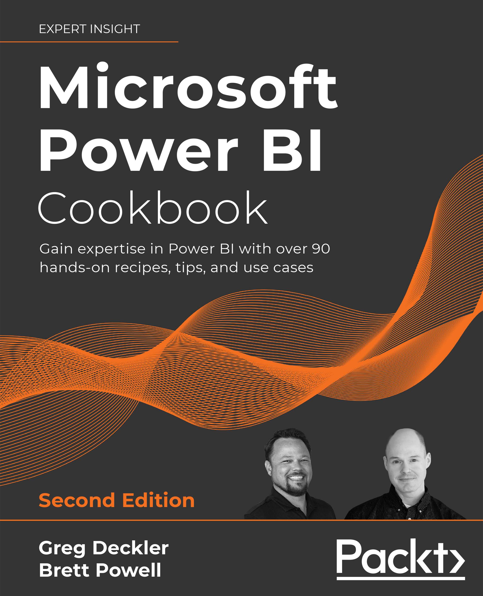

### Get this product for $5

<i>Packt is having its biggest sale of the year. Get this eBook or any other book, video, or course that you like just for $5 each</i>

<b>
[Buy now](https://packt.link/9781801813044)
</b>

<b>
[Buy similar titles for just $5](https://subscription.packtpub.com/search)
</b>

# Power BI Cookbook 2nd Edition

Build effective analytical data models, reports, and dashboards using the advanced features of Power BI

## Links

* [Amazon](https://www.amazon.com/Microsoft-Power-Cookbook-expertise-hands/dp/1801813043/)
* [Packt Publishing](https://www.packtpub.com/product/microsoft-power-bi-cookbook-second-edition/9781801813044)

## Key Features
Updated with new recipes on query optimization, aggregation tables, Power BI API, and paginated reports
Work with recipes across diverse Power BI platforms including the Power BI Service and Mobile Applications
Implement custom solutions with M and DAX languages through actionable guidance and proven development techniques
Book Description
Microsoft Power BI is a leading business intelligence and data analytics platform that provides tools and services for deriving insights from data. With revised practical recipes, Microsoft Power BI Cookbook, Second Edition helps you navigate Power BI tools and their advanced features. It also demonstrates the use of end-to-end solutions that integrate those features to get the most out of Power BI. This cookbook provides advanced design and development tips, and guidance on enhancing existing Power BI projects.

The updated edition enables you to implement evergreen frameworks that will stay relevant as Power BI updates. Get familiar with Power BI development tools and services by going deep into the data connectivity, transformation, modeling, visualization, and analytical capabilities of Power BI. Microsoft Power BI Cookbook, Second Edition enables Power BI’s functional programming languages of DAX and M to come alive to deliver powerful solutions to common business intelligence challenges.

## What you will learn
- Cleanse, stage, and integrate your data sources with Power Query (M)
- Remove data complexities and provide users with intuitive, self-service BI capabilities
- Build business logic and analysis into your solutions via the DAX programming language and dashboard-ready calculations
- Implement aggregation tables to accelerate query performance over large data sources
- Create and integrate paginated reports
- Understand the differences and implications of DirectQuery, Live Connections, Import, and Composite model datasets
- Integrate other Microsoft data tools into your Power BI solution

## Who This Book Is For
This book is for BI professionals who wish to enhance their knowledge of Power BI and the value of the Power BI solutions they deliver to business users. Those who are looking at quick solutions to common problems while using Power BI will also find this book to be an extremely useful resource. Familiarity with Power BI and working with datasets is essential. This book is not for beginners.

## Table of Contents
1. Configuring Power BI Tools
1. Accessing and Retrieving Data
1. Building a Power BI Data Model
1. Authoring Power BI Reports
1. Working in the Service
1. Getting Serious with Date Intelligence
1. Parameterizing Power BI Solutions
1. Implementing Dynamic User-Based Visibility in Power BI
1. Applying Advanced Analytics and Custom Visuals
1. Administering and Monitoring Power BI
1. Enhancing and Optimizing Existing Power BI Solutions
1. Deploying and Distributing Power BI Content
1. Integrating Power BI with Other Applications
### Download a free PDF

 <i>If you have already purchased a print or Kindle version of this book, you can get a DRM-free PDF version at no cost. Simply click on the link to claim your free PDF.</i>

 <a href="https://packt.link/free-ebook/9781801813044">https://packt.link/free-ebook/9781801813044 </a> 
